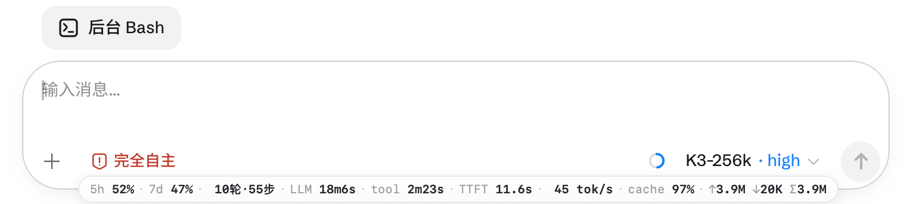
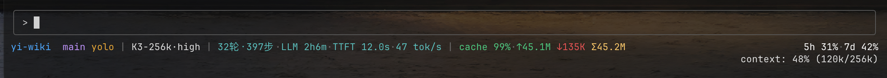

# kimi-stats-bar

给 [Kimi Code](https://www.kimi.com/code) 加一条会话用量统计——**Web UI 端**(`kimi web` 页面,支持 cmux 内嵌浏览器和任意浏览器的油猴脚本)+ **CLI TUI 端**(statusline),同一份统计口径。



```
5h 26% · 7d 41% · 10轮·55步 · LLM 18m6s · tool 2m23s · TTFT 11.6s · 45 tok/s · cache 97% · ↑3.9M ↓20K Σ3.9M
```

## 显示内容

| 段 | 含义 | 数据来源 |
| --- | --- | --- |
| `5h 26%` | 订阅 5 小时窗口配额 | REST `/api/v1/oauth/usage`(60s 轮询,账号级) |
| `7d 41%` | 订阅 7 天窗口配额 | 同上(`summary`) |
| `10轮·55步` | 会话 turn / step 数 | WS `turn.started` / `turn.step.completed` |
| `LLM 18m6s` | 模型耗时(首 token 延迟 + 流式时长之和) | WS `turn.step.completed` 时序字段 |
| `tool 2m23s` | 工具耗时(回合总时长 − LLM 耗时,近似) | WS `turn.ended.durationMs` |
| `TTFT 11.6s` | 首 token 平均延迟(Time To First Token) | WS `llmFirstTokenLatencyMs` |
| `45 tok/s` | 生成速度(输出 token ÷ 流式时长) | WS 计算 |
| `cache 97%` | 缓存命中率(缓存读 ÷ 总输入) | WS `usage.inputCacheRead` |
| `↑3.9M ↓20K` | 累计输入 / 输出 token | WS `turn.step.completed.usage` |
| `Σ3.9M` | 累计总消耗(输入+输出) | 同上 |

- 半透明磨砂胶囊,跟随系统深浅色(`prefers-color-scheme`),`pointer-events:none` 不挡交互
- 无会话页面显示占位(`5h 26% · 7d 41% · no session`),不会消失
- 切换会话自动重连并重放该会话历史

## 原理

cmux 的内嵌浏览器是 WKWebView,装不了 Chrome 扩展,但 cmux 提供了浏览器自动化 CLI,其中 `addinitscript` 等价于扩展的 content-script 注入。本脚本在页面里:

1. 从 `localStorage["kimi-web.server-credential"]` 读 server token;
2. 从 URL 解析当前 `session_<id>`;
3. 用子协议 `kimi-code.bearer.<token>` 连 `ws://…/api/v1/ws`,发 `client_hello` 携带订阅和 `cursor seq:0` **重放事件缓冲区的历史**(所以刷新页面统计不丢);
4. 应答应用层心跳 `ping → pong`(否则被服务端断连),断线用 `lastSeq` 增量续传。

纯本地:数据只来自本机 `127.0.0.1` 的 kimi web server,无任何外发。

## 使用

前置:Kimi Code CLI ≥ 0.38(实测版本)、`kimi web` 服务在跑(TUI 里 `/web` 或命令行 `kimi web`)。

web 端有两种注入方式,按你的浏览器选一:

### 方式一:cmux 内嵌浏览器(macOS)

```bash
./inject.sh              # 新开一个浏览器 pane 并注入
./inject.sh surface:N    # 注入到已有浏览器 surface
```

注入一次后对同一会话页长期有效(刷新、切会话都自动恢复)。

**自动注入(推荐)**:让 watcher 常驻后台,之后任何时候打开 kimi web 的浏览器 pane 都会自动注入,无需手动:

```bash
nohup ./watch-inject.sh >/dev/null 2>&1 &
```

watcher 每 4s 轮询 `cmux tree`,发现 URL 指向本机 kimi web server 端口的浏览器 surface 就注入一次(记录在 `.injected-surfaces`,不重复注入)。

### 方式二:任意浏览器 + 油猴(跨平台)

1. 浏览器装 [Tampermonkey](https://www.tampermonkey.net/)(Chrome / Edge / Firefox / Safari 均可);
2. 打开 [kimi-stats-bar.user.js](https://raw.githubusercontent.com/xinovate/kimi-stats-bar/main/kimi-stats-bar.user.js),Tampermonkey 会弹出安装页(本地试用就在 Tampermonkey 面板新建脚本,把文件内容粘进去);
3. 用同一个浏览器打开 `kimi web` 的地址(`http://127.0.0.1:<端口>`),统计条自动出现。

原理与 cmux 版完全相同(同一份 `kimi-stats-bar.js`,由 `build-userscript.sh` 拼接生成)。脚本靠 `localStorage["kimi-web.server-credential"]` 判断是否在 kimi web 页面,非 kimi web 的本地页面不会显示任何东西。改了 `kimi-stats-bar.js` 记得重跑 `./build-userscript.sh` 再提交。

## 已知限制

- `addinitscript` 是累加的:同一 surface 重复注入会叠版本(脚本内有 `__kimiStatsBar` 守卫,只有第一份生效)。改了脚本想生效,先 `cmux browser <surface> tab close` 再重开注入。
- 注入命令偶发 `Command timed out`,等页面加载完重试即可。
- 事件缓冲区上限约 1000 条,超长会话的早期历史会被截断,统计从可用区间算起。
- `tool` 耗时是近似值(回合总时长 − LLM 耗时),不含等待批准等人肉时间。
- API key 登录(无订阅配额)时 `5h`/`7d` 两段自动隐藏。
- 依赖 kimi web server 的 REST/WS 实验性 API,官方随时可能改字段;以 `GET /openapi.json` / `GET /asyncapi.json` 为准。

## 为什么不用 Chrome 扩展

[isme-jzy/kimi-usage-stats](https://github.com/isme-jzy/kimi-usage-stats) 是很好的 Chrome 扩展方案(还有逐模型拆分、热力图、花费估算),但 Chrome MV3 扩展进不了 cmux 的 WKWebView。本项目的 web 端是它的"cmux 平替 + 轻量油猴版":功能更少,但 cmux 和普通浏览器都能跑。

## CLI TUI statusline

`statusline.mjs` 是同口径的 TUI 状态行（`tui.toml` 的 `[status_line] command`）：

```
yi-wiki  main auto | K3-256k·high | 23轮·311步 · LLM 1h36m · TTFT 12.1s · 49 tok/s | cache 99% · ↑36.9M ↓102.9K Σ37M          5h 31% · 7d 42%
```



左侧按 `身份 | 模型·思考档 | 会话节奏 | token` 分组（`|` 分隔），`5h`/`7d` 配额**右对齐**贴终端右缘（白色；通过祖先进程 tty 链 + `stty -f` 探测宽度，宽度未知时退化为 `|` 拼接）。设 `NO_COLOR=1` 输出纯文本。

配色取自 Kimi Code TUI 官方色板（`theme/colors.ts`），映射表在脚本顶部 `ATTR_COLORS`，可自由改：项目名蓝、分支紫、模式金（plan 蓝）、模型灰白、节奏青、↑绿 ↓红 Σ黄、cache 按 ≥95/≥85/<85 绿金红渐变。

前缀 `项目名  分支 · 模式` 来自 stdin snapshot（`cwd` / `gitBranch` / `planMode` / `permissionMode`）；`command` 模式下内置槽位（项目、分支、模型等）不会自动显示，需要脚本自己输出。

配置 `~/.kimi-code/tui.toml`（TUI 里 `/reload-tui` 立即生效）：

```toml
[status_line]
command = "node /path/to/kimi-stats-bar/statusline.mjs"
```

- 数据源：TUI 经 stdin 传入的 JSON snapshot（`sessionId` 等）+ 增量扫描 `~/.kimi-code/sessions/*/session_<id>/agents/main/wire.jsonl`（offset 缓存在 `~/.kimi-code/statusline-cache/`，不重复解析全量）；`5h`/`7d` 走同一 REST 接口，60s 缓存 + 失败回退旧值
- 满足官方 300ms 上限：热路径约 30~50ms，冷启动约 250ms
- `kimi web` 服务没在跑时自动隐藏配额段；新会话显示 `0轮·0步` 占位
- 无 `tool` 段（wire.jsonl 不含可可靠归因的工具时长）
- 平台：macOS / Linux 全功能（右对齐依赖 `ps` + `stty`）；Windows 上宽度探测自动退化，配额段改为 `|` 拼接，其余正常

## License

MIT
